## Infrastructure Performance Comparison Report: Local PCIe vs. Network-Attached Storage
We have conducted a series of benchmark tests to evaluate the performance delta between our current Dedicated Infrastructure and the provided Networked Infrastructure. Both systems were tested under active load to simulate real-world production environments.

### The primary variable in this comparison is the storage architecture:

Our Current Infrastructure: Utilizes Direct Attached Storage (DAS) via the PCIe bus/Motherboard. This eliminates network overhead and provides the lowest possible latency.
Tested Infrastructure: Utilizes Network-Based Storage. Data traversal occurs over a network fabric, introducing encapsulation and switching overhead.
3. Objective of the Analysis
The goal of these tests—accompanied by the attached screenshots and output logs—is not merely to confirm that local storage is faster, but to quantify the performance gap. We aim to measure how the transition from a local PCIe interface to a networked environment impacts:

# Storage Performance Comparison Report
## Latitude vs NirvanaLab

## 1) Objective

This document compares the storage behavior of the two environments under live workload conditions using the same family of operational tools:

- `iostat`
- `ioping`
- `dstat`
- `iotop`

The goal is to evaluate the primary application storage path in each environment and determine which datacenter currently provides the stronger storage profile for the active Solana/Agave workload.

---

## 2) Scope of Comparison

To keep the comparison consistent, only the primary workload storage target was evaluated on each system:

| Datacenter | Target Volume | Mount Path | Device Used for Analysis |
|---|---|---|---|
| **Latitude** | main data/workload array | `/home` | **`md1`** |
| **NirvanaLab** | main data volume | `/data` | **`vdb` / `/dev/vdb1`** |

### Additional normalization rules
- For **`iostat`**, only the primary data device was considered:
  - Latitude: `md1`
  - NirvanaLab: `vdb`
- For **`iotop`**, only the **`agave-validator`** process was considered as the application-level storage consumer.
- For **`ioping`**, the direct test target was:
  - Latitude: `/home` on `md1`
  - NirvanaLab: `/data` on `/dev/vdb1`

---

## 3) Test Methodology

| Tool | Purpose | Interpretation |
|---|---|---|
| `ioping` | Measures storage latency and short-block response time | Best indicator for responsiveness and consistency |
| `iostat` | Measures sustained device-level read/write behavior | Best indicator for operational throughput, queue depth, and device pressure |
| `dstat` | Captures host-level disk burst behavior over time | Useful for identifying bursty write/read patterns |
| `iotop` | Identifies the top live I/O consumer process | Used here to isolate the `agave-validator` workload |

### Important note
These were **live operational measurements**, not a synthetic `fio` benchmark.  
Accordingly, this report reflects **real workload behavior**, which is often more useful operationally, but it should not be interpreted as a maximum hardware ceiling benchmark.

---

## 5) Detailed Results

## 5.1 `ioping` Comparison
Primary responsiveness test on the target data path.

| Metric | Latitude (`/home` on `md1`) | NirvanaLab (`/data` on `/dev/vdb1`) | Better |
|---|---:|---:|---|
| Min latency | **114.6 us** | 392.6 us | **Latitude** |
| Avg latency | **121.2 us** | 2.32 ms | **Latitude** |
| Max latency | **139.9 us** | 8.93 ms | **Latitude** |
| Latency deviation (mdev) | **8.17 us** | 3.06 ms | **Latitude** |
| IOPS | **8.25k** | 431 | **Latitude** |
| Throughput | **32.2 MiB/s** | 1.68 MiB/s | **Latitude** |

### Interpretation
Latitude delivered a substantially stronger latency profile:
- ~19x lower average latency
- much lower tail latency
- materially higher small-block IOPS

This indicates a far more responsive and stable storage path for the workload volume.

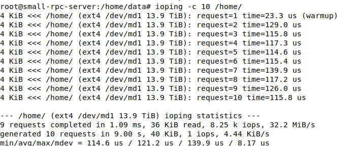

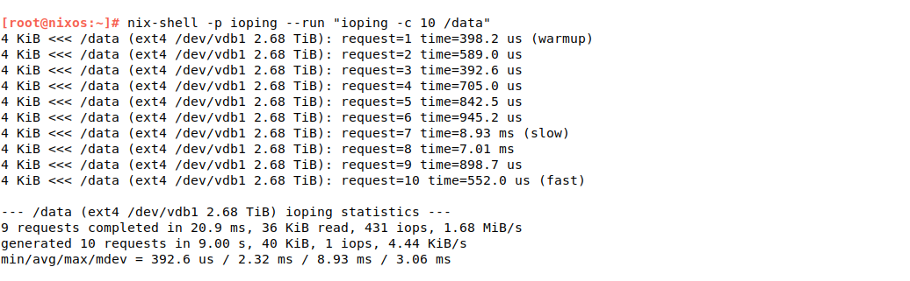

---

## 5.2 `iostat` Comparison
Device-level view of sustained read/write behavior on the primary workload device.

### Read-side comparison

| Metric | Latitude (`md1`) | NirvanaLab (`vdb`) | Better |
|---|---:|---:|---|
| Avg `r/s` | **985.71** | 44.70 | **Latitude** |
| Peak `r/s` | **3304.00** | 252.54 | **Latitude** |
| Avg `rkB/s` | **64407.56** | 4400.65 | **Latitude** |
| Peak `rkB/s` | **224218.00** | 40580.53 | **Latitude** |
| Avg `r_await` | **0.20 ms** | 0.89 ms | **Latitude** |
| Max `r_await` | **0.29 ms** | 1.49 ms | **Latitude** |

### Write-side comparison

| Metric | Latitude (`md1`) | NirvanaLab (`vdb`) | Better |
|---|---:|---:|---|
| Avg `w/s` | **2115.59** | 76.85 | **Latitude** |
| Peak `w/s` | **2734.00** | 382.00 | **Latitude** |
| Avg `wkB/s` | **207163.98** | 41719.49 | **Latitude** |
| Peak `wkB/s` | **266830.00** | 217698.00 | **Latitude** |
| Avg `w_await` | **3.26 ms** | 3.94 ms | **Latitude** |
| Max `w_await` | **4.94 ms** | 18.03 ms | **Latitude** |

### Queue and utilization comparison

| Metric | Latitude (`md1`) | NirvanaLab (`vdb`) | Interpretation |
|---|---:|---:|---|
| Avg `aqu-sz` | **7.32** | 0.89 | Latitude is servicing a much deeper queue |
| Max `aqu-sz` | **11.88** | 5.11 | Latitude carried more concurrent pressure |
| Avg `%util` | **19.23%** | 5.47% | Latitude is doing substantially more work |
| Max `%util` | **50.45%** | 18.20% | Latitude was more heavily exercised |

### Interpretation
Latitude is not merely “busier”; it is **handling materially more read and write traffic while maintaining better latency characteristics**.

This is the most important finding in the report:

> **Latitude sustained much higher storage throughput at better latency than NirvanaLab on the primary workload path.**

### nirvanalab
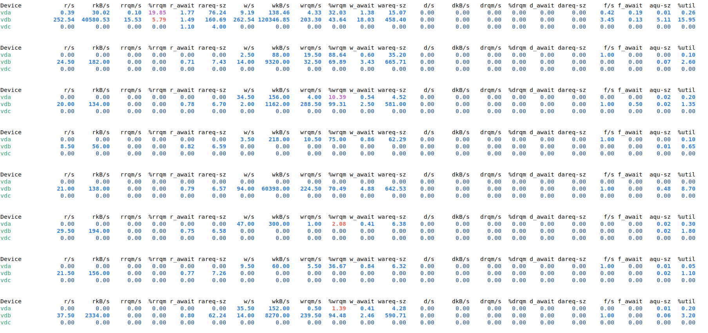

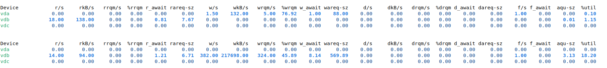


### latitude
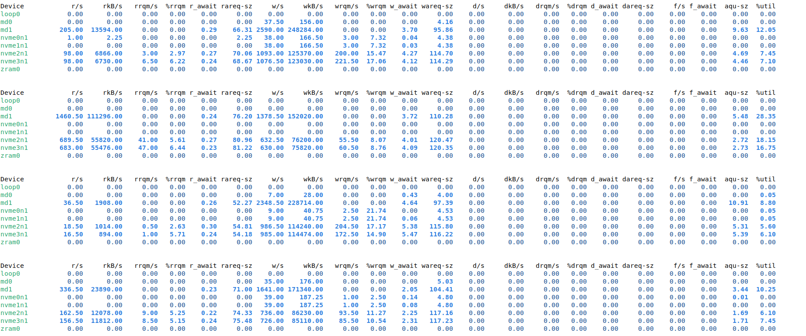

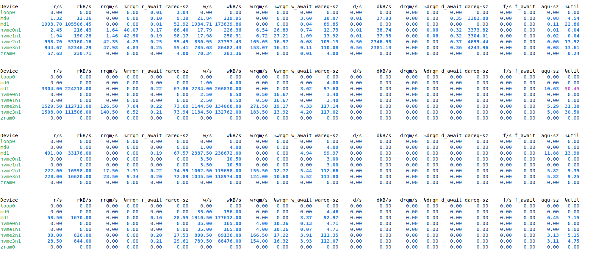


---

## 5.3 `dstat` Comparison
Host-level burst behavior over the sampling window.

| Metric | Latitude | NirvanaLab | Observation |
|---|---:|---:|---|
| Peak read | 8648k/s | **332M/s** | NirvanaLab showed larger read bursts |
| Peak write | 369M/s | **1374M/s** | NirvanaLab showed much larger write bursts |
| Average read (window) | 1653.7 kB/s | **54537.3 kB/s** | NirvanaLab was burstier at host level |
| Average write (window) | 40668.6 kB/s | **379748.3 kB/s** | NirvanaLab showed much heavier short-window write bursts |

### Interpretation
`dstat` reflects total host-level disk behavior and captures short-lived bursts.  
In this data set, **NirvanaLab showed significantly larger burst spikes**, especially on writes.

- NirvanaLab experiences larger burst behavior
- but its target storage path (`vdb` / `/data`) is less responsive and less consistent
- while Latitude sustains heavier workload more efficiently on the target data volume

### nirvanalab


### latitude
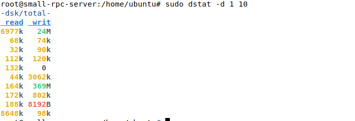

---

## 5.4 `iotop` Comparison
Application-level view focused on `agave-validator`.

| Metric | Latitude (`agave-validator`) | NirvanaLab (`agave-validator`) | Better |
|---|---:|---:|---|
| Process disk read | **40.32 M** | 25.48 M | **Latitude** |
| Process disk write | **336.82 M** | 208.61 M | **Latitude** |

### System totals observed in the same snapshots

| Metric | Latitude | NirvanaLab |
|---|---:|---:|
| Total disk read | 5.15 M/s | 272.28 K/s |
| Total disk write | 14.93 M/s | **22.80 M/s** |

### Interpretation
The `agave-validator` workload on Latitude is pushing more I/O than on NirvanaLab, yet the primary device still demonstrates better latency and stronger sustained throughput.

This is an indicator that Latitude has **more operational storage headroom** for the workload.

### nirvanalab
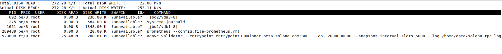

### latitude
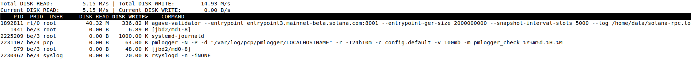

---

## 6) Operational Interpretation

### Latitude
Strengths observed:
- excellent small-block responsiveness on `md1`
- much higher sustained read/write rates
- better read latency and better worst-case write latency
- capable of servicing deeper queues without obvious storage distress

Operationally, this suggests Latitude is the stronger platform for the current Agave workload.

### NirvanaLab
Observations:
- larger short-lived write bursts at host level
- materially weaker latency profile on `/data`
- lower sustained throughput on the target device
- worse worst-case write latency

Operationally, NirvanaLab appears more sensitive to burst pressure and shows a less consistent storage response on the primary workload volume.


## Network Throughput Comparison
A network performance test was conducted using iperf3 to measure the throughput between the two datacenters. The results for each environment are documented below:

### Latitude vs NirvanaLab (`iperf3 -P 8 -t 30`)

### Test profile
The following comparison is based on parallel TCP throughput tests using:

- `iperf3`
- `8 parallel streams` (`-P 8`)
- `30 second duration` (`-t 30`)

This is a live end-to-end network test and reflects real path behavior at the time of measurement.

---

## Summary Table

| Metric | NirvanaLab | Latitude | Better |
|---|---:|---:|---|
| Sender transfer | 195 MB | **203 MB** | **Latitude** |
| Sender bitrate | 54.5 Mbit/s | **56.8 Mbit/s** | **Latitude** |
| Receiver transfer | 172 MB | **182 MB** | **Latitude** |
| Receiver bitrate | 47.7 Mbit/s | **50.7 Mbit/s** | **Latitude** |
| Total retransmissions | 9695 | **6488** | **Latitude** |
| Receiver/Sender efficiency | 87.5% | **89.3%** | **Latitude** |

---

## Stream-Level Comparison

| Stream | NirvanaLab Sender | Latitude Sender | Better |
|---|---:|---:|---|
| 1 | 5.10 Mbit/s | **10.2 Mbit/s** | **Latitude** |
| 2 | 2.62 Mbit/s | **6.29 Mbit/s** | **Latitude** |
| 3 | **10.6 Mbit/s** | 8.42 Mbit/s | **NirvanaLab** |
| 4 | **6.50 Mbit/s** | 4.75 Mbit/s | **NirvanaLab** |
| 5 | 7.58 Mbit/s | **8.77 Mbit/s** | **Latitude** |
| 6 | **8.25 Mbit/s** | 7.69 Mbit/s | **NirvanaLab** |
| 7 | **7.48 Mbit/s** | 6.19 Mbit/s | **NirvanaLab** |
| 8 | **6.33 Mbit/s** | 4.54 Mbit/s | **NirvanaLab** |

### Observation
Latitude delivered the better **aggregate throughput**, while NirvanaLab had a few stronger individual streams.  
This usually indicates that Latitude handled the parallel session set more efficiently overall.

---

## Retransmission Analysis

| Metric | NirvanaLab | Latitude |
|---|---:|---:|
| Total retransmissions | 9695 | 6488 |
| Retransmissions per second | 323.2/s | 216.3/s |
| Relative difference | baseline | **~33% fewer retransmissions** |

### Interpretation
Latitude showed a clearly better retransmission profile.

A lower retransmission count generally indicates:
- less packet loss,
- less congestion,
- better path stability,
- or better queue behavior somewhere along the route.

NirvanaLab’s retransmission count is materially higher, which suggests the path experienced more loss or congestion during the test window.

---

## Efficiency Analysis

| Metric | NirvanaLab | Latitude |
|---|---:|---:|
| Sender bitrate | 54.5 Mbit/s | 56.8 Mbit/s |
| Receiver bitrate | 47.7 Mbit/s | 50.7 Mbit/s |
| Delivery efficiency | 87.5% | 89.3% |

### Interpretation
Latitude not only sent more traffic, but also delivered a larger proportion of that traffic successfully to the receiving side.

This is a useful indicator that the Latitude path was slightly cleaner and more efficient during the test.

---

## Operational Conclusion

Based on this `iperf3` test:

> **Latitude showed better network performance than NirvanaLab in this measurement window.**

### Why Latitude is ahead
- higher aggregate sender throughput,
- higher aggregate receiver throughput,
- fewer retransmissions,
- slightly better end-to-end delivery efficiency.

### Important note
That said, both paths still show a **non-trivial retransmission level**, especially for a 30-second TCP test with 8 parallel streams.

This suggests that:
- the route is not completely clean,
- there may be congestion, policing, shaping, or packet loss on the path,
- and more network validation should be performed before treating this as an optimal path.


### Nirvana
```bash
[ ID] Interval           Transfer     Bitrate         Retr
[  5]   0.00-30.00  sec  18.2 MBytes  5.10 Mbits/sec  1062            sender
[  5]   0.00-30.20  sec  14.9 MBytes  4.13 Mbits/sec                  receiver
[  7]   0.00-30.00  sec  9.38 MBytes  2.62 Mbits/sec  514            sender
[  7]   0.00-30.20  sec  8.00 MBytes  2.22 Mbits/sec                  receiver
[  9]   0.00-30.00  sec  38.0 MBytes  10.6 Mbits/sec  2319            sender
[  9]   0.00-30.20  sec  34.6 MBytes  9.62 Mbits/sec                  receiver
[ 11]   0.00-30.00  sec  23.2 MBytes  6.50 Mbits/sec  928            sender
[ 11]   0.00-30.20  sec  20.2 MBytes  5.62 Mbits/sec                  receiver
[ 13]   0.00-30.00  sec  27.1 MBytes  7.58 Mbits/sec  935            sender
[ 13]   0.00-30.20  sec  23.2 MBytes  6.46 Mbits/sec                  receiver
[ 15]   0.00-30.00  sec  29.5 MBytes  8.25 Mbits/sec  1249            sender
[ 15]   0.00-30.20  sec  26.8 MBytes  7.43 Mbits/sec                  receiver
[ 17]   0.00-30.00  sec  26.8 MBytes  7.48 Mbits/sec  1848            sender
[ 17]   0.00-30.20  sec  23.9 MBytes  6.63 Mbits/sec                  receiver
[ 19]   0.00-30.00  sec  22.6 MBytes  6.33 Mbits/sec  840            sender
[ 19]   0.00-30.20  sec  20.0 MBytes  5.56 Mbits/sec                  receiver
[SUM]   0.00-30.00  sec   195 MBytes  54.5 Mbits/sec  9695             sender
[SUM]   0.00-30.20  sec   172 MBytes  47.7 Mbits/sec                  receiver

```

### Latitude
```bash
- - - - - - - - - - - - - - - - - - - - - - - - -
[ ID] Interval           Transfer     Bitrate         Retr
[  5]   0.00-30.00  sec  36.4 MBytes  10.2 Mbits/sec  1264            sender
[  5]   0.00-30.13  sec  32.5 MBytes  9.05 Mbits/sec                  receiver
[  7]   0.00-30.00  sec  22.5 MBytes  6.29 Mbits/sec  793            sender
[  7]   0.00-30.13  sec  19.9 MBytes  5.53 Mbits/sec                  receiver
[  9]   0.00-30.00  sec  30.1 MBytes  8.42 Mbits/sec  1123            sender
[  9]   0.00-30.13  sec  26.4 MBytes  7.34 Mbits/sec                  receiver
[ 11]   0.00-30.00  sec  17.0 MBytes  4.75 Mbits/sec  572            sender
[ 11]   0.00-30.13  sec  15.9 MBytes  4.42 Mbits/sec                  receiver
[ 13]   0.00-30.00  sec  31.4 MBytes  8.77 Mbits/sec  771            sender
[ 13]   0.00-30.13  sec  29.5 MBytes  8.21 Mbits/sec                  receiver
[ 15]   0.00-30.00  sec  27.5 MBytes  7.69 Mbits/sec  793            sender
[ 15]   0.00-30.13  sec  24.1 MBytes  6.72 Mbits/sec                  receiver
[ 17]   0.00-30.00  sec  22.1 MBytes  6.19 Mbits/sec  787            sender
[ 17]   0.00-30.13  sec  18.6 MBytes  5.19 Mbits/sec                  receiver
[ 19]   0.00-30.00  sec  16.2 MBytes  4.54 Mbits/sec  385            sender
[ 19]   0.00-30.13  sec  15.2 MBytes  4.25 Mbits/sec                  receiver
[SUM]   0.00-30.00  sec   203 MBytes  56.8 Mbits/sec  6488             sender
[SUM]   0.00-30.13  sec   182 MBytes  50.7 Mbits/sec                  receiver
```


# MTR TCP Path Comparison Report
## NirvanaLab vs Latitude


```bash
sudo mtr --tcp 8.8.8.8
````

This report compares the observed TCP path behavior from:

* **NirvanaLab**
* **Latitude**

toward `8.8.8.8`.

### nirvanalab
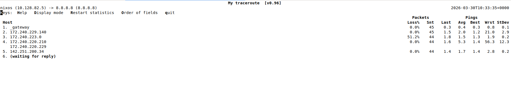

### latitude
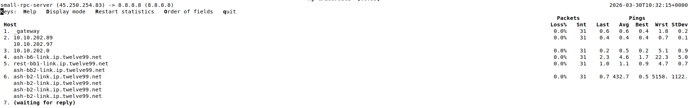


## 2) Summary

| Metric                      | NirvanaLab                                   | Latitude                                        | Initial Assessment                       |
| --------------------------- | -------------------------------------------- | ----------------------------------------------- | ---------------------------------------- |
| Local gateway health        | Clean                                        | Clean                                           | Both healthy at source                   |
| Early-hop latency           | Low                                          | Low                                             | Both good                                |
| Intermediate anomaly        | One hop with **51.2% loss**                  | One hop with **extreme latency/jitter**         | Both show one abnormal transit response  |
| Last visible responding hop | Stable                                       | Stable before noisy transit hop                 | No immediate proof of end-to-end failure |
| Overall path quality        | Generally clean with one suspicious-loss hop | Generally clean with one suspicious-latency hop | Mixed                                    |

---

## 3) NirvanaLab Results

### Observed Path

| Hop | Host                            |      Loss |    Avg |   Best |   Worst | StDev |
| --- | ------------------------------- | --------: | -----: | -----: | ------: | ----: |
| 1   | `_gateway`                      |      0.0% | 0.4 ms | 0.3 ms |  0.8 ms |   0.1 |
| 2   | `172.240.229.140`               |      0.0% | 2.0 ms | 1.2 ms | 21.0 ms |   2.9 |
| 3   | `172.240.223.0`                 | **51.2%** | 1.5 ms | 1.3 ms |  1.9 ms |   0.2 |
| 4   | `172.240.220.210 / 172.220.229` |      0.0% | 5.3 ms | 1.4 ms | 56.3 ms |  12.3 |
| 5   | `142.251.200.34`                |      0.0% | 1.7 ms | 1.4 ms |  2.8 ms |   0.2 |

### Assessment

* Local gateway is healthy.
* Early path latency is low.
* One intermediate hop shows **51.2% TCP-probe loss**.
* Later visible hop responses continue with **0.0% loss**.
* Path appears generally usable, with one suspicious intermediate-loss point.

---

## 4) Latitude Results

### Observed Path

| Hop | Host                                                           | Loss |          Avg |   Best |       Worst |    StDev |
| --- | -------------------------------------------------------------- | ---: | -----------: | -----: | ----------: | -------: |
| 1   | `_gateway`                                                     | 0.0% |       0.6 ms | 0.4 ms |      1.8 ms |      0.2 |
| 2   | `10.10.202.89 / 10.10.202.97`                                  | 0.0% |       0.4 ms | 0.4 ms |      0.7 ms |      0.1 |
| 3   | `10.10.202.0`                                                  | 0.0% |       0.5 ms | 0.2 ms |      5.1 ms |      0.9 |
| 4   | `ash-b6-link.ip.twelve99.net`                                  | 0.0% |       4.6 ms | 1.7 ms |     22.3 ms |      5.0 |
| 5   | `rest-bb1-link.ip.twelve99.net / ash-bb2-link.ip.twelve99.net` | 0.0% |       1.1 ms | 0.9 ms |      4.7 ms |      0.7 |
| 6   | `ash-b2-link.ip.twelve99.net`                                  | 0.0% | **432.7 ms** | 0.5 ms | **5158 ms** | **1122** |

### Assessment

* Local gateway is healthy.
* Early path latency is low.
* One transit hop shows **extreme TCP-probe latency and jitter**.
* No visible packet loss is shown on the responding hops.
* Path appears generally usable, with one suspicious intermediate-latency point.

---

## 5) Comparative View

| Category                         | NirvanaLab     | Latitude       |
| -------------------------------- | -------------- | -------------- |
| Gateway condition                | Healthy        | Healthy        |
| Early path stability             | Good           | Good           |
| Intermediate packet loss         | Higher concern | Lower concern  |
| Intermediate latency anomaly     | Lower concern  | Higher concern |
| Clear end-to-end failure visible | No             | No             |

---

Based on the observed `mtr --tcp` output to `8.8.8.8`:

* **NirvanaLab** shows one intermediate hop with significant visible TCP-probe loss.
* **Latitude** shows one intermediate hop with severe visible TCP-probe latency/jitter.
* Both paths appear healthy near the source.
* Neither result alone proves a hard end-to-end connectivity failure.


